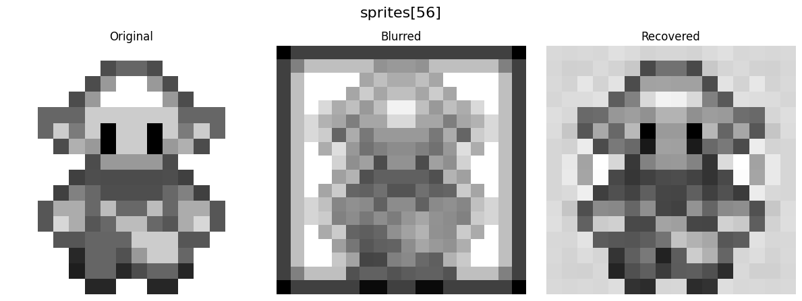

# Image-Processing-Toolkit-IPT2

**ES 204: Digital Systems Course Project**  
**Instructor:** Prof. Joycee Mekie 
**Project Supervisor:** Abhinav Goud 

This repository contains our HDL sources and related attempts for the Image Processing Toolkit project under ES 204

[Presentation Video](https://iitgnacin-my.sharepoint.com/:v:/g/personal/23110235_iitgn_ac_in/EeJDMtfDzz5BoWzdD0xFGr0BaWJ4S9Mznzy35i6VOBUMnQ?e=29h3d7)

Team: 
- Krish Patel (23110235) 
- Kshitij Agarwal (23110173) 
- Rudra Pratap Singh (23110281) 
- Swayam Borate (23110066)
